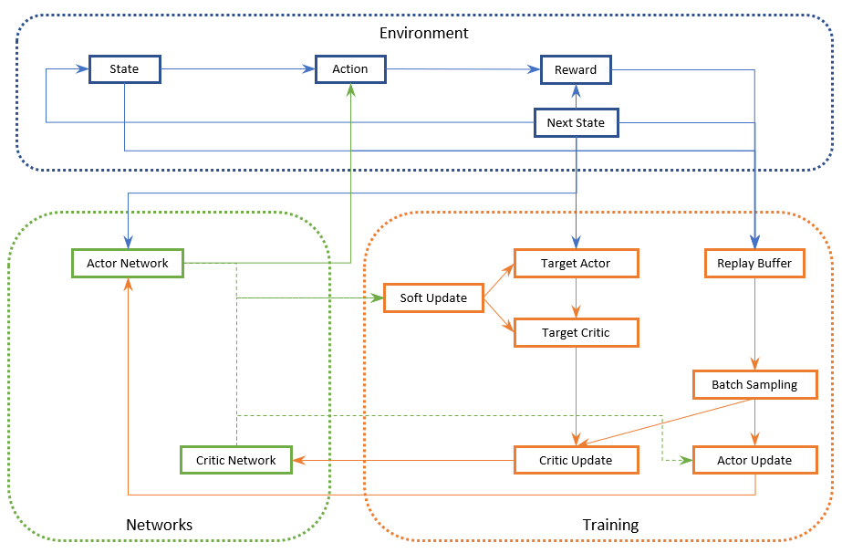

# BusControl_RL
# Multi-Agent Reinforcement Learning for Bus Control Optimization

## Overview
Multi-agent reinforcement learning (MARL) for bus is an intelligent control system, designed to optimize bus dispatch at stops and reduce bus bunching on routes.  
It trains multiple agents (buses) to learn dynamic holding strategies using centralized training and decentralized execution.  
By integrating a simulation environment, centralized critic, and custom reward functions, MARL-Bus provides an adaptive, data-driven solution for enhancing bus service reliability.

---

## Key Features
- **Reinforcement Learning Control**  
  - Actor-Critic architecture for each agent (bus)  
  - Decentralized actor networks with centralized critic  
  - Adaptive and continuous holding time decisions

- **Simulation-based Environment**  
  - Customizable multi-bus environment  
  - Realistic travel time and passenger modelling using sampled distributions  
  - Automatic overtake-prevention logic based on vehicle order

- **Reward Function Design**  
  - `r1`: Headway deviation  
  - `r2`: Holding cost  
  - `r3`: Bunching penalty  
  - Smooth reward shaping using tanh and sigmoid; modifiable weights for flexible prioritization

---

## Technical Specifications

### Critic / Actor Parameters

| Parameter    | Default Value | Description                                                                                  |
|--------------|---------------|----------------------------------------------------------------------------------------------|
| NUM_AGENTS   | 12            | Number of agents (buses) running in one route                                                |
| STATE_DIM    | 4             | `[stop ID, forward headway, occupancy, fleet order]`                                         |
| ACTION_DIM   | 1             | Holding level [0,1]                                                                          |
| HIDDEN_DIM   | 256           | Number of neurons in hidden layers                                                           |
| LR_ACTOR     | 1e-4          | Learning rate for the actor network optimizer                                                |
| LR_CRITIC    | 2e-4          | Learning rate for the critic network optimizer                                               |
| LR_DECAY     | 0.995         | Exponential decay factor for the learning rate scheduler                                     |

> **Note for states:**  
> - **Stop ID (INT):** Stop index for holding decision  
> - **Forward headway (FLOAT):** Time gap between consecutive buses [10, 2×TARGET_HEADWAY] (seconds)  
> - **Occupancy (FLOAT):** Passengers / bus capacity [0,1]  
> - **Fleet order (INT):** Sequential bus number, reordered after one loop

---

### Environment Parameters

| Parameter           | Default Value             | Description                                                                                     |
|---------------------|---------------------------|-------------------------------------------------------------------------------------------------|
| NUM_STOPS           | 44 (for A2386)            | Number of stops in one route                                                                    |
| TARGET_HEADWAY      | 600 sec                   | Ideal time gap between arrival of consecutive buses at one stop                                  |
| MAX_HOLD            | 120 sec                   | Maximum holding time                                                                            |
| BUNCHING_THRESHOLD  | 0.1 × TARGET_HEADWAY     | Headway threshold for bunching                                                                  |
| CAPACITY            | 140                       | Maximum number of passengers onboard                                                            |
| ALIGHT_TIME         | 2                         | Alighting time per passenger (seconds)                                                          |
| BOARD_TIME          | 3                         | Boarding time per passenger (seconds)                                                           |
| DOOR_TIME           | 5                         | Door open/close time (seconds)                                                                  |
| REST_TIME           | 120 sec                   | Rest time for the final stop before restarting                                                  |
| REWARD_SCALE        | 2                         | Overall scale for rewards                                                                       |
| HEADWAY_SCALE       | 1                         | Weight for headway deviation                                                                    |
| HOLDING_SCALE       | 0.2                       | Weight for holding cost                                                                         |
| BUNCHING_SCALE      | 0.8                       | Weight for bunching penalty                                                                      |

---

### Training Parameters

| Parameter           | Default Value | Description                                                                                     |
|---------------------|---------------|-------------------------------------------------------------------------------------------------|
| BATCH_SIZE          | 64            | Number of experiences (transitions) sampled from the replay buffer                              |
| BUFFER_SIZE         | 100000        | Maximum number of past transitions stored                                                        |
| GAMMA               | 0.995         | Discount factor                                                                                 |
| TAU                 | 0.005         | Soft update factor for target networks                                                          |
| MAX_EPISODES        | 400           | Maximum training episodes                                                                        |
| NUM_STEP            | 6×(len(stop_id)+1) | Training step limit                                                                             |
| WARMUP_EPISODES     | 30            | Episodes for collecting experience without updating networks                                     |
| WARMUP_STEPS        | len(stop_id)+1| Initial steps without training in each episode                                                   |
| EPSILON_START       | 1.0           | Initial exploration threshold                                                                     |
| EPSILON_END         | 0.2           | Minimum exploration threshold                                                                     |
| EPSILON_DECAY       | 0.995         | Exploration decay rate                                                                           |
| GRAD_CLIP           | 0.5           | Gradient norm clipping for actor/critic                                                           |
| WEIGHT_DECAY        | 1e-5          | Regularization weight decay                                                                       |
| MAX_VALUE           | 1e6           | Value clipping for stability                                                                      |
| REWARD_CLIP         | 5.0           | Reward clipping for stability                                                                      |
| PATIENCE            | 50            | Max episodes without improvement                                                                   |
| MIN_EPISODES        | 150           | Minimum training episodes                                                                          |
| IMPROVEMENT_THRESHOLD | 0.02       | Reward increment threshold for improvement                                                          |

---

## System Architecture

- **Actor-Critic Structure:**  
  - **Actors:** Output the action/policy based on state; aim to maximize the Q-score from critic  
  - **Critic:** Assess the actor's action (Q-score), predict Q and real profit, and minimize the difference

- **Multi-Agent Deep Deterministic Policy Gradient (MADDPG)**

---

## Training & Evaluation Workflow

1. Initialize environment and actor–critic networks  
2. Warm-up phase: collect experience without learning  
3. Experience gathering: agents interact with environment  
4. Training (`RL_bus_A2386.py`):  
   - Each agent trains its own actor  
   - All agents share a centralized critic  
5. Evaluation:  
   - Load saved actor policies  
   - Evaluate performance and identify the best  
6. Inference / Application (`Call_BestModel.py`):  
   - Load actor class and best model  
   - Input bus states, generate actions from the model  

---

## Outputs

- The best policy models, able to infer action values for buses based on current state.

---

## File Dependencies

| File                        | Description                                                                                  |
|-----------------------------|----------------------------------------------------------------------------------------------|
| `travel time_norm_*.xlsx`  | Travel time distributions based on 1-week data (Normal distribution), ordered by stop        |
| `route_*.json`             | The stops and segments of one route (stop sequence)                                          |
| `Hist_data.csv`            | Historical data for each segment (travel time, mean speed, etc.)                             |
| *(processed via `DataPrepare.py`)* | Data processing script                                                                 |

---

## Deployment Notes

- Built on PyTorch, GPU-supported  
- Modular environment for extensibility  
- Compatible with future integration: SUMO, GTFS, OpenAI Gym-style frameworks

---

